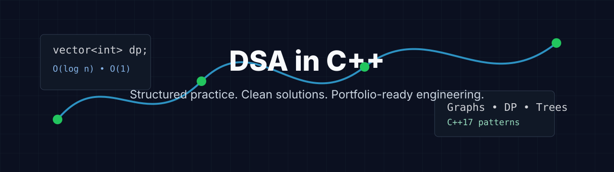

<div align="center">

# DSA in C++

### A structured DSA repository in C++17 covering Arrays, Trees, Graphs, DP, and more.




[](https://github.com/Divgagan)
[](https://www.linkedin.com/in/gagan-diwakar-772134293/)
[](https://leetcode.com/u/Gagan747/)
[](https://www.geeksforgeeks.org/profile/amandiwakar747?tab=activity)

</div>

---

## Repository Snapshot

A structured DSA repository in C++17 covering Arrays, Trees, Graphs, DP, and more.
Each problem includes clean, optimized solutions with time & space complexity analysis,
built for placement interviews, competitive programming, and continuous learning.

<!-- STATS:START -->
| Metric | Value |
|---|---:|
| Total topic folders | 25 |
| C++ solution files | 55 |
| Markdown guides | 47 |
| Completion | 3% |
| Last generated | 2026-07-07 |
<!-- STATS:END -->

## Tech Stack

| Area | Tools |
|---|---|
| Language | C++17 / C++20 ready |
| Build style | Single-file competitive programming solutions |
| Documentation | Markdown, Shields.io, SVG assets |
| Automation | Python 3, GitHub Actions |
| Practice platforms | LeetCode, GeeksForGeeks |

## Repository Structure

```text
DSA_in_C++/CPP
|-- Arrays/
|-- Strings/
|-- LinkedList/
|-- Stack/
|-- Queue/
|-- Trees/
|-- BST/
|-- Heap/
|-- Hashing/
|-- Recursion/
|-- Backtracking/
|-- Greedy/
|-- BinarySearch/
|-- SlidingWindow/
|-- TwoPointers/
|-- BitManipulation/
|-- Graphs/
|-- DynamicProgramming/
|-- Tries/
|-- SegmentTree/
|-- DisjointSet/
|-- Math/
|-- PatternWise/
|-- ContestProblems/
|-- General/
|-- assets/
|-- scripts/
|-- templates/
`-- .github/workflows/
```

## DSA Roadmap Tracker

<!-- ROADMAP:START -->
| Topic | Status | Solved | Target | Progress |
|---|---|---:|---:|---|
| Arrays | In Progress | 15 | 50 | `[###-------]` 30% |
| Strings | In Progress | 0 | 40 | `[----------]` 0% |
| LinkedList | In Progress | 1 | 30 | `[----------]` 3% |
| Stack | In Progress | 1 | 25 | `[----------]` 4% |
| Queue | In Progress | 0 | 20 | `[----------]` 0% |
| Trees | In Progress | 8 | 45 | `[##--------]` 18% |
| BST | In Progress | 0 | 25 | `[----------]` 0% |
| Heap | In Progress | 0 | 25 | `[----------]` 0% |
| Hashing | In Progress | 0 | 35 | `[----------]` 0% |
| Recursion | In Progress | 0 | 30 | `[----------]` 0% |
| Backtracking | In Progress | 0 | 30 | `[----------]` 0% |
| Greedy | In Progress | 0 | 35 | `[----------]` 0% |
| BinarySearch | In Progress | 2 | 35 | `[#---------]` 6% |
| SlidingWindow | In Progress | 0 | 25 | `[----------]` 0% |
| TwoPointers | In Progress | 0 | 25 | `[----------]` 0% |
| BitManipulation | In Progress | 0 | 25 | `[----------]` 0% |
| Graphs | In Progress | 0 | 60 | `[----------]` 0% |
| DynamicProgramming | In Progress | 1 | 75 | `[----------]` 1% |
| Tries | In Progress | 0 | 20 | `[----------]` 0% |
| SegmentTree | In Progress | 0 | 25 | `[----------]` 0% |
| DisjointSet | In Progress | 0 | 20 | `[----------]` 0% |
| Math | In Progress | 0 | 35 | `[----------]` 0% |
| PatternWise | In Progress | 0 | 50 | `[----------]` 0% |
| ContestProblems | In Progress | 0 | 50 | `[----------]` 0% |
| General | In Progress | 1 | 30 | `[----------]` 3% |
<!-- ROADMAP:END -->

## Progress Tracking

| Difficulty | Solved | Focus |
|---|---:|---|
| Easy | 0 | Fundamentals, syntax speed, edge cases |
| Medium | 0 | Interview patterns, optimized thinking |
| Hard | 0 | Advanced DP, graphs, data structures |

## LeetCode Profile

<div align="center">


</div>

## GeeksForGeeks Profile

<div align="center">

[](https://www.geeksforgeeks.org/profile/amandiwakar747?tab=activity)

</div>

| Metric | Source |
|---|---|
| Coding score | GFG stats card and profile |
| Problems solved | GFG stats card and profile |
| Streak | GFG profile activity |
| Monthly score | GFG profile activity |

## Coding Platforms

| Platform | Purpose | Profile |
|---|---|---|
| LeetCode | Interview patterns and contests | [Gagan747](https://leetcode.com/u/Gagan747/) |
| GeeksForGeeks | Placement preparation and streaks | [amandiwakar747](https://www.geeksforgeeks.org/profile/amandiwakar747?tab=activity) |

## Weekly Activity

<!-- ACTIVITY:START -->
```text
Mon  ######----
Tue  ###-------
Wed  ######----
Thu  ######----
Fri  ######----
Sat  ######----
Sun  ######----
```
<!-- ACTIVITY:END -->

## Daily Consistency Tracker

| Week | Mon | Tue | Wed | Thu | Fri | Sat | Sun |
|---|---|---|---|---|---|---|---|
| Current | [ ] | [ ] | [ ] | [ ] | [ ] | [ ] | [ ] |
| Previous | [ ] | [ ] | [ ] | [ ] | [ ] | [ ] | [ ] |

## Activity Heatmap

<div align="center">


</div>

## Problem Documentation Standard

Every solution should include:

| Field | Description |
|---|---|
| Problem Name | Exact problem title |
| Platform | LeetCode, GFG, or custom |
| Difficulty | Easy, Medium, Hard, or contest rating |
| Approach | Short explanation of the idea |
| Time Complexity | Big-O runtime |
| Space Complexity | Big-O memory |
| Code | Clean C++ implementation |

Use [templates/problem.md](templates/problem.md) and [templates/solution.cpp](templates/solution.cpp) for every new problem.

## Contribution Philosophy

This repository values clarity, consistency, and learning depth. A good solution here is not only accepted by an online judge; it is readable, documented, edge-case aware, and easy for another learner or interviewer to understand.

Preferred contribution style:

| Principle | Standard |
|---|---|
| Correctness first | Include edge cases and constraints |
| Explain the idea | Keep approach notes concise and useful |
| Complexity matters | Add time and space complexity |
| Topic discipline | Place solutions in the most relevant folder |
| Maintainability | Use stable naming and reusable templates |

## Automation

| Workflow | Purpose |
|---|---|
| README auto-update | Regenerates stats, roadmap, and activity blocks |
| LeetCode stats refresh | Keeps profile widgets and generated stats fresh |
| Contribution graph generation | Builds a local SVG heatmap |
| Repository metrics generation | Produces JSON metrics for portfolio use |

Run locally:

```bash
python scripts/update_stats.py
python scripts/generate_heatmap.py
python scripts/sync_readme.py
```

## Footer

<div align="center">

**Built for disciplined DSA practice, clean C++ thinking, and portfolio-grade visibility.**

Created and maintained by [Gagan Diwakar](https://github.com/Divgagan). Connect on [LinkedIn](https://www.linkedin.com/in/gagan-diwakar-772134293/).

</div>

